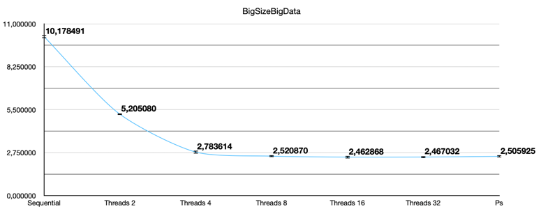
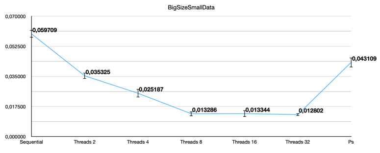
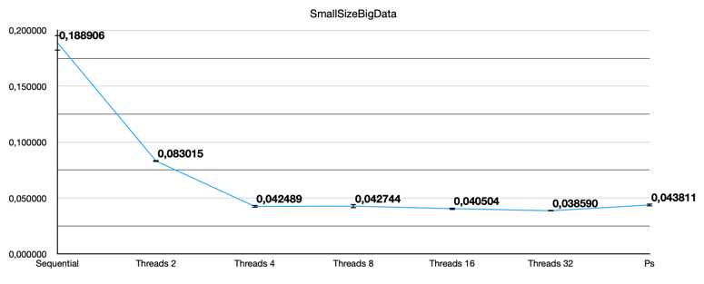
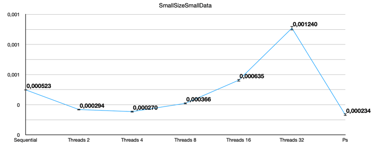

# Поиск составногоо числа
В данной задаче реализованы три алгоритма поиска составного
числа в массиве простых чисел. Каждый алгоритм получает на вход массив чисел
и в качестве результата выполнения возвращает `true` если составное число найдено и `false` иначе.

## Реализации
* **Sequential** – последовательный алгоритм. 
* **Threads** – алгоритм, использующий Threads с разным количеством потоков.
* **Parallel stream** – алгоритм, использующий Parallel Stream.

## Исследование скорости поиска
Для каждой реализации алгоритма было проведено исследование скорости выполнения.
Для этого были сгенерированы 4 набора чисел с помощью вспомогательного класса `DataGenerator`:
* bigSizeBigData – Числа примерно равные 1_000_000_000. Размер массива 1_000_000
* bigSizeSmallData – Числа не превосходящие 10_000. Размер массива 1_000_000
* smallSizeBigData – Числа примерно равные 1_000_000_000. Размер массива 10_000
* smallSizeSmallData – Числа не превосходящие 10_000. Размер массива 10_000

Данные на которых производились измерения находятся в корневой папке задачи с соответствующими
названиями. Для генерации данных для самостоятельного исследования можно воспользоваться 
классов `DataGenerator`.

Далее будут представлены графики, отображающие результаты исследования. На вертикальной оси отмечено **время в секундах**,
на горизонтальной **реализации алгоритмов**. Графики показывают время работы
в секундах на 4 различных наборах данных.
1. bigSizeBigData

2. bigSizeSmallData

3. smallSizeBigData

4. smallSizeSmallData

**Рис 1-4**. Измерение скорости работы алгоритмов на 4 наборах данных.
На вертикальной оси отмечено **время в секундах**, на горизонтальной оси **реализация алгоритма**.
На графиках указаны среднее значение скорости работы и доверительные интервалы 95%.
Наборы данных описаны выше. Количество запусков подобрано достаточно большим, чтобы
средние значения и доверительные интервалы были достоверными.

## Итог исследования
Как и ожидалось, последовательный(`Sequential`) алгоритм будет значительно проигрывать своим многопоточным братьям.

Рассмотрим реализацию `Threads`. Как видно из графиков, на достаточно больших массивах хорошо виден прирост в 
скорости выполнения алгоритма при использовании бОльшего количества потоков. Однако, после 8 потоков, прирост 
незначителен. Объясняется это ядерностью машины, на которой производились измерения(ЦП имеет 8 ядер).
Также можно заметить, что на массиве smallSizeSmallData время выполнения возрастает после `Threads8` так как тратится
больше ресурсов и времени на "распараллеливание" алгоритма, нежели на чистое выполнение алгоритма.   

Реализация через `ParallelStream` хорошо себя показывает при работе с большими числами (~1_000_000_000), время
выполнения примерно схоже с реализацией `Threads16` и `Threads32`. Это можно объяснить тем, что уходит большое
количество времени и ресурсов на "распараллеливание" алгоритма. Однако, при работе с маленькими числами алгоритм
выигрывает `Threads` во времени выполнения. 

Исходя из анализа полученных данных, можно выдвинуть некоторые рекомендации по использованию алгоритмов с разными
наборами данных. Последовательный алгоритм неплохо себя показывает на небольших(~10000 элементов). Но, Threads с 2
потоками имеет прирост скорости почти вдвое. Однако, при уменьшении размера массива, реализации `Sequential` и `Threads`
будут стремиться к одному времени выполнения.

Но, при работе с большими массивами, в независимости от размера чисел, будет выигрывать алгоритм 
`Threads`. Графики это подтверждают, на них прекрасно видно, что реализации Threads с 8 16 или 32 потоками выигрывают 
ParallelStream. Так что лучше всего использовать реализацию `Threads`. Однако, при маленьких размерах массивов и данных
стоит рассмотреть `ParallelStream`.
